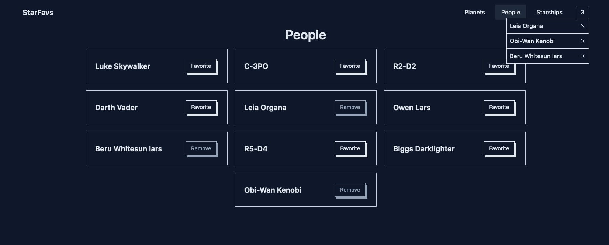

# StarFavs - Created as take home test for [Cytora](http://www.cytora.com/)

## ⚒️ Tech Stack

React.js - Redux (RTK Query) - React Router - TailwindCSS - SWAPI - Unsplash

## Description

Simple web application that allow users to search for specific person, planet or starship and allows to add your favourite character to a list.

## How to run

The app has been built with Vite.js, in order to run it you just have to:

- clone/download from this repository
- install all dependencies with `npm i`
- (Optional) add the **VITE_UNSPLASH_ACCESS** API key in the `.env`, I've provided a fallback but probably is not the best approach
- run with `npm run dev`
